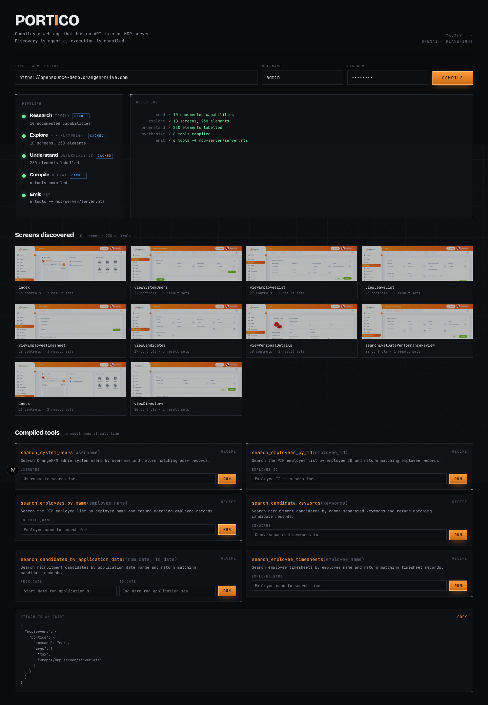

# Portico

**Compiles a web app that has no API into an MCP server.**

Point Portico at a login page. It explores the app, works out what each control does, and writes a
standalone MCP server with typed tools — `search_employees_by_name(employee_name)` — that any agent
can call. Discovery is agentic and happens once. Execution is a compiled Playwright recipe with no
model in the loop.



---

## 1. What it solves

Most software in the world has no API. Internal admin panels, council portals, twenty-year-old HR
systems: the data is right there on screen and completely unreachable by an agent.

Today an agent has two options, and both are bad. It can go without — the task simply cannot be
automated. Or it can burn a computer-use session on _every single call_: a fresh agent opens a
browser, squints at the page, clicks around, and costs seconds and cents to answer "what is Linda
Anderson's employee ID?" Ask the same question twice and you pay twice.

Portico makes it a compile step. You pay an agent **once** to understand the app, and from then on
the same question is one typed MCP tool call — a page load and three DOM actions, no model, no
reasoning, no drift. On the OrangeHRM demo below, that call returns a structured record in **8.7
seconds** and costs nothing but the page load.

## 2. The thesis

> **Discovery is agentic. Execution is compiled.**

This is the whole idea, and everything in the repo follows from it.

Understanding an unfamiliar UI genuinely needs intelligence — reading a screen, telling a records
table from a settings pane, knowing that "Employee Name" is a person and "Sub Unit" is a filter.
That is a job for an agent, and it is worth paying real money for.

_Replaying_ a known interaction needs no intelligence at all. Once you know the URL, the selector
and the field, calling the tool is a script. Every model call at execution time is latency, cost
and a chance to hallucinate.

So Portico puts all the intelligence in the compiler and none in the runtime. The generated MCP
server (`mcp-server/server.mts`) contains no LLM calls whatsoever — grep it and see.

## 3. Demo

**Video:** _(2-minute walkthrough — add the link here before submitting)_

The screenshot above is a real run against the [OrangeHRM public
demo](https://opensource-demo.orangehrmlive.com) (`Admin` / `admin123`), an entirely API-less HR
admin app. From one URL and a password, Portico found 10 screens and 230 controls, and compiled 6
parameterized tools.

Verified end to end:

```
$ npx tsx scripts/run-tool.ts search_system_users username=Admin
Calling search_system_users({"username":"Admin"})

--- returned ---
Admin | Admin | Emp_qBPmlQ User_hrEPXuHM | Enabled
```

That same call takes 8.7 s from the console's **run** button, and returns the same record over MCP
`tools/call` through the generated server.

## 4. How it works

```
  Tavily          h + Playwright     rule table           OpenAI            MCP SDK
    │                    │                 │                 │                 │
  ┌─▼──────┐   ┌─────────▼───────┐   ┌─────▼──────┐   ┌──────▼─────┐   ┌───────▼──────┐
  │ 1 seed │──▶│   2 explore     │──▶│3 understand│──▶│4 synthesize│──▶│   5 emit     │
  └────────┘   └─────────────────┘   └────────────┘   └────────────┘   └──────────────┘
  Capability[]     SiteMap            Labeled[]         ToolSpec[]       server.mts
  what the app     screens, exact     what each         typed tools +    a runnable
  claims to do     selectors          control *is*      step recipes     MCP server
```

Every stage is cached to `fixtures/<slug>/<stage>.json`, so iterating on stage 4 never re-runs the
browser crawl — and `REPLAY=1` runs the whole pipeline from disk with no network at all.

### Stage 1 — seed (`app/_lib/stages/seed.ts`)

**In:** a URL. **Out:** `Capability[]`. **Powered by:** Tavily search + OpenAI structured outputs.

A blind crawl only ever discovers what is linked from the landing page. Public documentation names
features the way _humans_ do — "assign leave", "shortlist a candidate" — which gives the explorer
goals to aim at and gives the compiler vocabulary for tool descriptions that read like a product
rather than a DOM dump. Tavily returned 10 documented capabilities for OrangeHRM.

### Stage 2 — explore (`app/_lib/stages/h-scout.ts` + `explore.ts`)

**In:** capabilities + credentials. **Out:** `SiteMap`. **Powered by:** h computer-use agent, then
Playwright.

The split here is the most important design decision in the project. h's `web-surfer-flash` agent
logs in and _looks at_ the app, returning the URLs of the screens where records actually live — via
a Zod `answerSchema`, so the answer is structured, not prose. It found 8, including **Performance
Reviews** and **Job Titles**, which the blind link crawl never reached.

h is never asked for a selector. Prose cannot be replayed deterministically and a hallucinated
selector is a broken tool. Instead Playwright visits h's URLs and harvests exact,
reload-survivable selectors — plus a screenshot and the repeating result containers (tables, card
grids) that a read tool can return. 10 screens, 230 controls, 0 positional selectors.

If h is slow or unavailable, the pure-Playwright BFS crawl stands in and the pipeline continues.

### Stage 3 — understand (`app/_lib/stages/understand.ts`)

**In:** `SiteMap`. **Out:** `Labeled[]`. **Powered by:** a deterministic rule table.

Every one of those 230 controls needs a verdict: is this a search input, a filter, a submit, a nav
link, a create button, something destructive? And if it takes a value, what kind — a person, a
date, an identifier? Stage 4 cannot write `search_employees_by_name(employee_name)` without knowing
which input is the search box and what it holds.

This is the one stage with **no model in it, by choice.** It is the highest-volume step in the
pipeline — 230 verdicts for this one app, one per control — and the judgment each one needs is
shallow: "Delete" is destructive, a `<select>` narrows a result set, a field labelled "Employee
Name" holds a person. Sending that to a frontier model would add hundreds of calls to every compile
to answer questions a rule table answers in microseconds, and answers the *same way every run*.
That reproducibility is the point: recompiling an app twice yields the same tools.

The honest cost of that choice is that the rules read English label text, which is the main thing
standing between this and "works on any admin panel". See §9.

### Stage 4 — synthesize (`app/_lib/stages/synthesize.ts`)

**In:** `SiteMap` + `Labeled[]`. **Out:** `ToolSpec[]`. **Powered by:** OpenAI structured outputs.

This is the one genuinely hard reasoning step, and it gets the frontier model. Given the screens,
the labelled controls and the documented capabilities, it emits tools with a JSON Schema and a step
recipe. The load-bearing field is `Step.arg`: when set, that step takes its value from a named tool
parameter at call time instead of a literal. That is the difference between a parameterized tool and
a fixed macro. All 6 generated tools are parameterized.

### Stage 5 — emit (`app/_lib/mcp/emit.ts`)

**In:** `ToolSpec[]`. **Out:** `mcp-server/server.mts` + `tools.json` + a paste-ready config.
**Powered by:** `@modelcontextprotocol/sdk`.

The emitted server is standalone and contains no model calls. It shares one runtime with the web UI
(`app/_lib/driver/run.ts`), so what you test in the console is exactly what an agent gets.

## 5. Partner technologies

Three partners, each doing the thing it is actually best at — and one stage, stage 3 above,
deliberately using none of them.

| Partner    | Where                                      | What it does                                                                                | Without it                                                                       |
| ---------- | ------------------------------------------ | ------------------------------------------------------------------------------------------- | -------------------------------------------------------------------------------- |
| **Tavily** | `app/_lib/stages/seed.ts`                  | Finds public docs for the target app and distils them into task-shaped capabilities         | The explorer has no goals; tool descriptions come from DOM text and read like it  |
| **h**      | `app/_lib/stages/h-scout.ts`               | Computer-use agent logs in, looks at the app, returns the URLs of screens that hold records | Falls back to a blind BFS crawl, which missed 2 of the 8 record screens           |
| **OpenAI** | `app/_lib/stages/seed.ts`, `synthesize.ts` | Distils capabilities; compiles screens + labels into typed tools with step recipes          | No tool synthesis — the pipeline stops at a site map                             |

Playwright is the deterministic runtime underneath all of it (`app/_lib/driver/`), and
`@modelcontextprotocol/sdk` writes the output.

## 6. Setup

**Prerequisites:** Node 20+, npm, and a machine that can run Chromium.

```bash
npm install
npx playwright install chromium
```

Create `.env.local` in the repo root:

```bash
# OpenAI — capability distillation (stage 1) and tool synthesis (stage 4).
# https://platform.openai.com/api-keys
OPENAI_API_KEY=sk-...

# Tavily — documentation search (stage 1). https://tavily.com
TAVILY_API_KEY=tvly-...

# h — the computer-use scout (stage 2). https://hub.hcompany.ai
HAI_API_KEY=...
```

Stage 3 needs no key — it is the deterministic one.

Then:

```bash
npm run dev     # http://localhost:3000
```

Paste a URL and credentials into the console and press **compile**. The OrangeHRM demo
(`https://opensource-demo.orangehrmlive.com`, `Admin` / `admin123`) is pre-filled.

### Running with no API keys at all

```bash
REPLAY=1 npm run dev                    # the console, served from fixtures
REPLAY=1 npx tsx scripts/compile.ts     # the same pipeline, headless
```

Replay mode serves every stage from the committed fixtures in `fixtures/`, with realistic pacing
and no network calls:

```
[seed]        ✓ 10 documented capabilities (cached)
[explore]     ✓ 10 screens, 230 elements (cached)
[understand]  ✓ 230 elements labelled (cached)
[synthesize]  ✓ 6 tools compiled (cached)
[emit]        ✓ 6 tools -> mcp-server/server.mts
```

A judge with zero keys still sees the entire pipeline run, the real screens,
the real generated tools and the real MCP server. In replay mode a missing fixture is a hard error
rather than a silent fallback to the network.

## 7. Using the generated MCP server

Compiling writes `mcp-server/server.mts`, `mcp-server/tools.json` and a ready-made config. To attach
it to Claude Code:

```bash
claude mcp add portico -- npx tsx /absolute/path/to/repo/mcp-server/server.mts
```

Or paste into your MCP client config (this is what the console's **copy** button gives you):

```json
{
  "mcpServers": {
    "portico-opensource-demo-orangehrmlive-com": {
      "command": "npx",
      "args": ["tsx", "/absolute/path/to/repo/mcp-server/server.mts"],
      "env": {
        "PORTICO_USERNAME": "Admin",
        "PORTICO_PASSWORD": "admin123"
      }
    }
  }
}
```

An example call and its result:

```jsonc
// tools/call
{ "name": "search_system_users", "arguments": { "username": "Admin" } }

// result — a real row from the live OrangeHRM demo
{ "content": [{ "type": "text",
  "text": "Admin | Admin | Emp_qBPmlQ User_hrEPXuHM | Enabled" }] }
```

(The demo instance is public and its employee names get overwritten by other visitors, so the
values you see will differ — the shape will not.)

The six tools compiled from OrangeHRM: `search_system_users`, `search_employees_by_id`,
`search_employees_by_name`, `search_candidate_keywords`, `search_candidates_by_application_date`,
`search_employee_timesheets`.

## 8. Project layout

```
app/
  page.tsx                     the console: target form, live pipeline, tools, MCP config
  layout.tsx  globals.css      root layout; all design tokens (Tailwind v4, no config file)
  _components/
    PipelineRail.tsx           the five stages as an electrical conduit that energises in turn
    LogStream.tsx              SSE build log, pinned to the newest line
    ToolCard.tsx               a compiled tool: signature, recipe, and a form to call it live
  _lib/
    types.ts                   the spine — every stage and every fixture is one of these shapes
    cache.ts                   per-stage disk cache and REPLAY mode
    pipeline.ts                the compiler: runs all five stages, yields progress events
    stages/seed.ts             1. Tavily + OpenAI -> Capability[]
    stages/h-scout.ts          2a. h computer-use agent -> record-screen URLs
    stages/explore.ts          2b. Playwright harvest -> SiteMap (selectors, shots, containers)
    stages/understand.ts       3. rule table -> Labeled[] (role + entity per control)
    stages/synthesize.ts       4. OpenAI structured outputs -> ToolSpec[]
    mcp/emit.ts                5. ToolSpec[] -> a standalone MCP server on disk
    driver/playwright.ts       login, selector harvesting, recipe execution
    driver/run.ts              the shared tool runtime — UI and MCP server both call this
  api/compile/route.ts         POST {url, creds} -> SSE stream of stage events
  api/run-tool/route.ts        POST {tool, args} -> executes a recipe live
scripts/                       one runner per stage, for iterating without the UI
  compile.ts                   the whole pipeline headlessly — how you rehearse a replay
  run-tool.ts                  call a compiled tool from the terminal
fixtures/<slug>/*.json         recorded stage outputs; what REPLAY=1 serves
mcp-server/                    generated output: server.mts, tools.json, claude_mcp_config.json
public/shots/                  screenshots captured during the crawl
```

## 9. Limitations and what's next

Where this is honestly weak:

- **Selectors are brittle against redesigns.** They survive reloads and pagination, not a
  re-skin. Recompiling is cheap, but nothing currently _detects_ that a tool has gone stale — a
  health check that replays each recipe and flags empty reads is the obvious next step.
- **No write-tool safety rails.** The compiler can describe `destructive` controls but there is no
  confirmation step, dry-run or audit log, so we deliberately kept the demo to read and search
  tools. Writes need a human-in-the-loop gate before they should exist at all.
- **Auth is username/password only.** No SSO, MFA, or session reuse; credentials are passed to the
  generated server via environment variables.
- **Stage 3's rules read English.** Classifying controls by label text is fast, free and
  reproducible, but it is monolingual and it inherits whatever vocabulary the app uses — a German
  admin panel, or one that labels its search box "Lookup", degrades to `other` and produces flatter
  tools. The stage is one function (`classify` in `understand.ts`) behind a stable
  `SiteMap -> Labeled[]` signature, so swapping in a small classifier is a contained change; the
  reason to want one is coverage, not accuracy on English apps.
- **It assumes the target is a record-oriented app.** Pointed at a marketing site, stage 1 returns
  generic admin capabilities, and the scout — primed to look for record screens that do not exist —
  can answer with a different application's URLs. Off-origin hints are now discarded in
  `h-scout.ts` and again in `explore.ts`, so the worst case is a thin site map rather than tools
  compiled against the wrong app. Recognising "this app has no records" and saying so is not built.
- **One target app is proven.** Portico was built and verified against OrangeHRM. The stages are
  app-agnostic by construction, but "works on any admin panel" is a claim we have not earned yet.
- **The read heuristic favours tables.** Apps that render records as prose or canvas will produce
  tools that return page text rather than structured rows.
- **Local only.** The generated MCP server runs over stdio on the machine that compiled it.

---

Built at Tech: Europe Hackathon, London.
